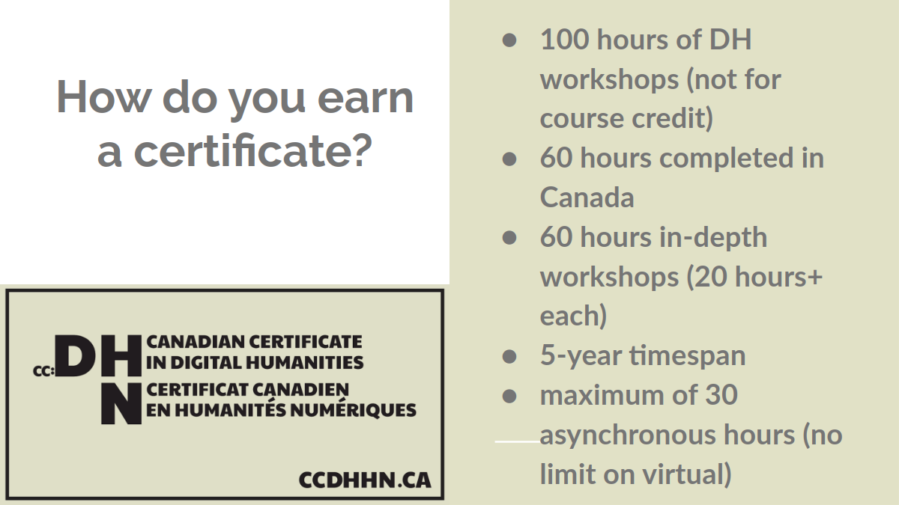
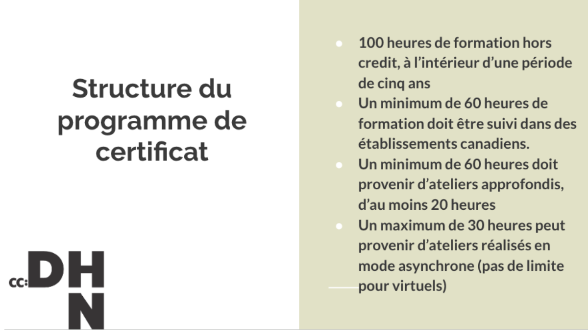
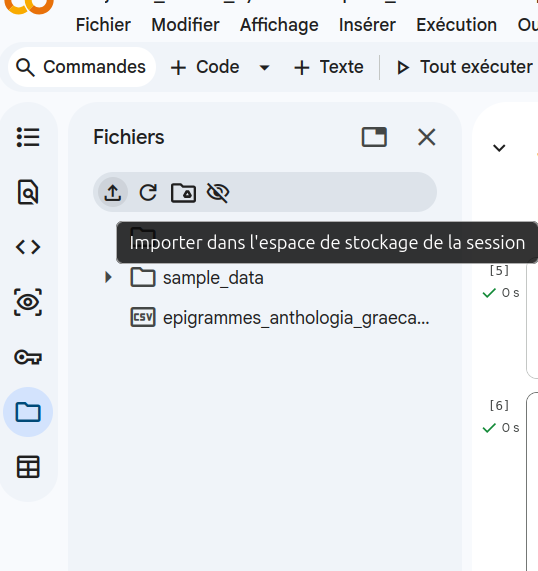
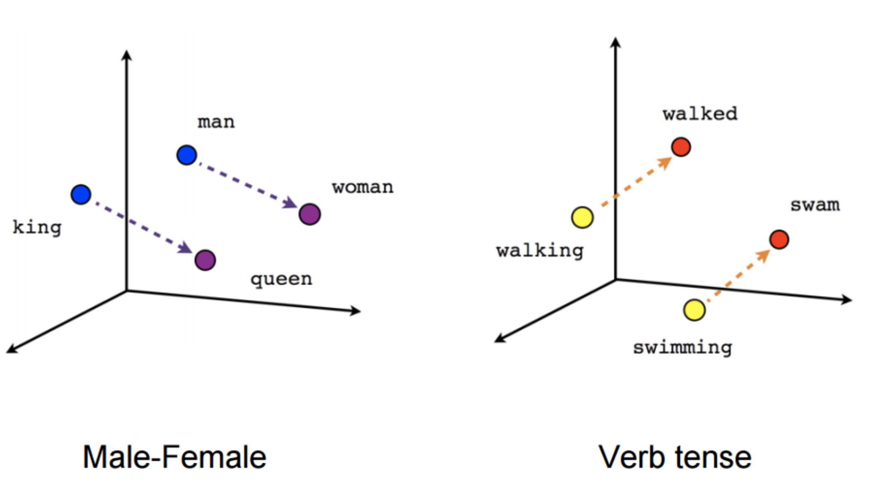
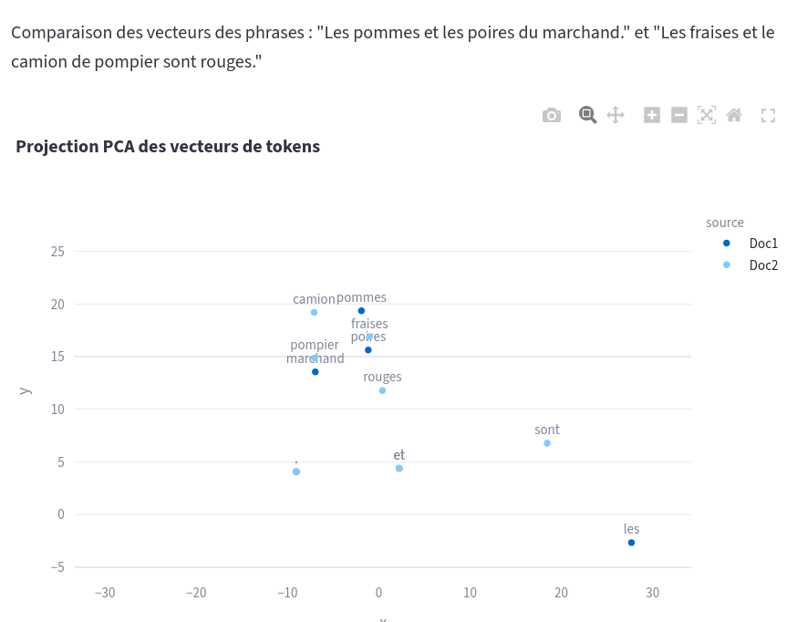

## Programme de la journée 


11h -12h : 

- Installation, présentation des formateur.ices 
- Tour de table des participant.es 
- Présentation du déroulement de la semaine et de cette journée en particulier 

13h30 - 16h :

- Présentation théorique et historique générale de l'IA. (1h30)
- Présentation du corpus fil rouge de la semaine
- Mise en place de l'environnement de travail (Python, notebook via Colab ou Jupyter) 
- Démonstration / Exercice sur la différence entre IA symboliste et connexionniste

# Présentation des formateur.ices 

# Tour de table

## Objectifs de la semaine

- Comprendre les fondamentaux de l'IA et son histoire
- Tester par soi-même des programmes d'automatisation de tâches pour l'analyse de corpus en SHS
- Obtenir des notions critiques sur le fonctionnement des outils dits d'IA


## Certificat canadien en Humanités Numériques





[Information sur le certificat](https://ccdhhn.ca/)

## Déroulement de la semaine 

- Jour 1 - Théorie de l'IA : systèmes experts et approches inductives 
- Jour 2 - Traitement automatique de la langue et prétraitement de texte 
- Jour 3 - Apprentissage profond : outils et applications
- Jour 4 - Modèles génératifs : Correction, annotation et structuration de données textuelles
- Jour 5 - Recherche, synthèse et extraction de connaissances 

# Des questions ?

# Pause déjeuner

## Objectifs de l'après-midi

Théorie : 

- Qu'est-ce que l'IA ? 
- Étudier l'IA pour les SHS
- Retours historiques
- Typologie des IA


- Cas d'usage et modélisation experte (ELIZA)
- Principe fondamentaux de l'apprentissage machine (modèles spécialisés)
- Les LLMs : les modèles généralistes et les systèmes agentiques.

# Des exemples d'"Intelligences Artificielles" ? 

## Exemples d'IA 

::: {.incremental}

- Chatbots,
- Algorithmes de détection sur des imageries médicales, 
- OCR et HTR (reconnaissance optique de caractère et reconnaissance d'écriture manuscrite)
- DeepBlue, AlphaGo
- Une calculette ? 
- La fonction Ctrl + F ? 

:::


## Qu'est ce que l'Intelligence Artificielle ? 

Des programmes informatiques capables d'effectuer des tâches que nous estimons devoir demander une forme d'intelligence : une intelligence humaine. 

'IA' depuis 5 ans, a remplacé le 'numérique' des années 2010, et le 'cyberespace' des années 1990 et 2000 [@vitali-rosatiManifestePourEtudes2025]. 

Définition pratique pour ces ateliers: "automatisation de la cognition" @abbassEditorialWhatArtificial2021 pour "Transactions on Artificial Intelligence"


## L'IA et les SHS

~~À quoi sert d'étudier l'IA pour les chercheur.ses en SHS~~

Que peuvent faire les SHS pour l'IA ? 

- participer à la réflexion actuelle sur son utilisation : 
- mettre en perspective le technosolutionnisme. 
- élaborer un propos scientifique sur l'IA qui ait un peu de hauteur, éviter l'effet 'benchmarking' (i.e. comparaison des modèles ou des entreprises qui les mettent à disposition)
- proposer un avis sur l'utilisation de ces outils qui soit propre à sa discipline (ex: distinguer des usages en fonction des besoins particuliers de son domaine). 


## Histoire de l'Intelligence artificielle (partie 1)

**L'histoire de l'IA se mêle à l'histoire de la computation et de l'algorithmique**  

IIIe ou IIe s. avant notre ère: [machine d'Anticythère](https://fr.wikipedia.org/wiki/Machine_d'Anticyth%C3%A8re)

VIIIe s. mathématicien Al-Khwârizmî donne son nom aux algorithmes.

XIe s : 1e machine à computation : horloge astronomique d'Al-Jazari  

1613 : terme "computer" utilisé pour la première fois par Richard Braithwait -> une personne qui calcule.

1694 : le [calculus ratiocinator](https://fr.wikipedia.org/wiki/Calculus_ratiocinator) de Leibniz capable de faire les 4 opérations arithmétiques de base (addition, soustraction, multiplication, division).

("ordinateur" : 1955 proposé par un latiniste Jacques Perret pour la communication d'IBM)

1822-42: "la machine à différence" de Babbage basé sur les cartes perforées des machines à tisser Jacquart.  

> At each increase of knowledge as well as on the contrivance of every new tool, human labour becomes abridged. 

Babbage "la machine analytique" machine hypothétique avec capacité de computation pour différents problèmes, doté d'une mémoire -> [Ada Lovelace](https://fr.wikipedia.org/wiki/Ada_Lovelace) première programmeuse 1843. 

1890 : "tabulatrice" électromécanique d'[Hollerith](https://fr.wikipedia.org/wiki/Herman_Hollerith) développée pour le recensement USAméricain -> précurseur de la companie IBM.

1920s: [Vannevar Bush](https://fr.wikipedia.org/wiki/Vannevar_Bush) conçoit l'"analyseur différentiel" : proto-ordinateur pour le calcul d'équations différentielles.


## Histoire de l'Intelligence artificielle (partie 2)

**À partir du XXe siècle, on ne s'intéresse plus seulement aux machines qui font, mais aux machines qui pensent.**

1930s : Turing définit les termes du fonctionnement d'une "machine automatique". 

1935[ Hypothèse Church-Turing ](https://fr.wikipedia.org/wiki/Th%C3%A8se_de_Church): définition de la calculabilité : la méthode de calcul respecte un nombre fini d'instructions simples, l'algorithme fournit toujours un résultat, les instructions ne demandent pas d'intelligence de la part de l'humain qui les suit. 


1941 : Z3 de Konrad Zuse  calculateur électromagnétique programmable binaire, parfois nommé "le premier ordinateur".

1940s : Science-fiction et roman d'Isaac Asimov _Runaround_ en 1942.

[@turingComputingMachineryIntelligence1950] : 'Can machines think?'

1944 : Harvard Mark I d'Howard Aiken, programmeuse Grace Hopper conçoit les premiers compileurs et le langage de programmation de bas niveau COBOL.

1951 : UNIVAC, premier ordinateur "general purpose machine" commercialisé.

1956: 'intelligence artificielle' terme utilisé pour la première fois par Minsky et McCarthy àpour une demande de subvention de la Dartmouth Summer Research Project on Artificial Intelligence (DSRPAI). -> une économie de la promesse. 


1966 : ELIZA [@weizenbaumELIZAComputerProgram1966]

1974-1980 : (Rapport Lighthill en 1974) premier hiver de l'IA 

1990-2000s : Deuxième hiver de l'IA -> termes moins connotés : "_machine learning_" ou plus généralement, "informatique"

1997 :  DeepBlue d'IBM bat Kasparov.

2015 : AlphaGo de Google bat Fan Hui.

2020s : Nouveau printemps de l'IA 


## Brève histoire de l'IA (pt. 2)

Depuis le milieu des années 2010 : pic des systèmes d'IA avec une modélisation distributionnelle du language (vecteur). Word2Vec [@mikolovEfficientEstimationWord2013], GloVE [@penningtonGloVeGlobalVectors2014]. Parmi les avancées majeures de cette modélisation on compte le mécanisme d'attention [@vaswaniAttentionAllYou2017] et l'encodage bidirectionnel BERT [@devlinBERTPretrainingDeep2019] qui permettent l'arrivée de modèles très performants comme le GPT-3 d'OpenAI [@brownLanguageModelsAre2020]. 

Actuellement : tendance à l'hybridation de ces modèles : Neuro-Symbolic Integration, Semantic Web Machine Learning [@marcusNextDecadeAI2020; @russellArtificialIntelligenceModern2022]

## Typologie de l'IA

- IA symboliste ou systèmes experts : programme conçu à partir d'une logique déductive c'est à dire à partir de **règles** précises. Représentation classique sous forme d'arbe de décision _if then_.
  - Avantages : maîtrise et transparence du système. 
  - Désavantages : 
    - Faible capacité d'adaptation à de nouvelles données ou circonstances, il faut reprendre le système. 
    - Travail principal : modélisation de la tâche à effectuer.


- IA connexionniste : programme conçu à partir d'une logique inductive. Modélisation d'un programme à partir d'un grand volume de données. Ce sont les **motifs de répétitions** qui permettent à la machine d'émettre une prédiction. C'est le principe de l'apprentissage machine (_machine learning_). 
  - Avantages: prédiction possible sur de nouvelles données (à condition que des données pertinentes aient été fournies lors de l'entrainement). 
  - Désavantages : 
    - Plus grande chance d'opacité : les données, les paramétres d'entrainement et l'algorithme d'inférence produisent des prédictions possiblement différentes qu'il est plus difficile d'expliquer a postériori.
    - Travail principal : récolte des données, annotation des données. 


# Exemple plus concret 


## Présentation du corpus de travail pour la semaine


<!-- à compléter au besoin par William (5min) -->

## Petite mise en place

1. Repo du cours : 

Pour les personnes familières de Git : https://github.com/alexiaschn/dhsi-2026/

```git clone https://github.com/alexiaschn/dhsi-2026.git```

Pour les moins familiers : 

Code > Download source code > zip 

Extraire dans le dossier de son choix.

2. Plusieurs solutions pour utiliser un notebook interactif Jupyter : 

Si Python est installé sur sa machine : 

- via son IDE de choix comme VSCode/VSCodium : télécharger le module Jupyter et sélectionner son interpréteur Python (Cmd + P : Python interpreter)
- via Anaconda UI
- via Jupyter après installation : 

à la racine du repo : 
```
python3 -m pip install --upgrade pip
python3 -m pip install jupyter
jupyter notebook
```
puis ouvrir le localhost : le Notebook Dashboard devrait apparaitre avec l'arborescence du repo

Si Python n'est pas installé :

Depuis un compte Google : 
Télécharger l'application Colab
https://colab.research.google.com

Fichier > Importer le notebook 

NB : il faudra bien penser à importer manuellement pour chaque notebook les documents du corpus 




## Pratique : concevoir un système expert 

Objectif : obtenir un programme capable de classer une phrase selon une thématique prédéfinie. 

Objectif : Classification d'un texte soit en "parle d'animal" soit en "ne parle pas d'animal". 


## Modéliser une approche experte 

Principe de base : faire appel à un expert pour pour déterminer les règles qui définissent ce qui est une phrase parlant d'animal.
  - exemple de règles possibles : liste de mots 'chien, chat, perroquet,  etc.' ordre des mots ou POS (_part-of-speach tagging_) pour distinguer le loup de la "gueule de loup", l'oiseau de l'"oiseau de paradis" . 


Une approche simpliste en apparence mais qui peut s'avérer très complexe (ex: traduction, jeu de Go) et qui se trouve à l'origine de l'automatisation de nombreuses tâches effectuées au quotidien (ex: tri du pourriel, détection de mouvement, logistique de grande échelle). 


## Exemple d'un programme conversationnel /génération textuelle avec une approche experte ELIZA

Try it yourself : [ELIZA](https://anthay.github.io/eliza.html)

>Eliza is a pattern-matching automated psychiatrist. Given a set of rules in the form of input/output patterns, Eliza will attempt to recognize user input phrases and generate relevant psychobabble responses. Each rule is specified by an input pattern and a list of output patterns. A pattern is a sentence consisting of space-separated words and variables. [@connellyElizapy]  


Exemple de _literate programming_ [@knuthLiterateProgramming1984] : 

[Lire le code d'ELIZA](https://dhconnelly.com/paip-python/docs/paip/eliza.html)


## Approche inductive 

### 1e étape Modélisation des données

- **Constitution d'un corpus** : obtenir un ensemble important de documents 
- **Annotation** : attribution d'une classe à chaque document par un humain/expert, _ground truth_ ou vérité de terrain. 
- **Représentation des données** : sélection des caractéristiques représentatives du jeu de données (par exemple, les mots ! ou une représentation vectorielle de chaque document ou mot).
<!-- - **Encodage vectoriel** : Comptage des tokens dans l'ensemble du jeu de données et dans chaque phrase/document. 
- On obtient une représentation vectorielle = coordonnées dans un espace vectoriel à _n_ dimensions. -->






### 2e étape Choix de l'algorithme de classification

Cette étape vise à  mettre en rélation les caractéristiques représentant les données et la classe attribuée lors de l'annotation. L'objectif est d'obtenir le meilleur algorithme ou la meilleure logique permettant de discriminer un document d'un autre. 

Différentes logiques permettent de discriminer les données entre elles. Quelques exemples d'algorithmes d'apprentissage machine classique (sur des vecteurs): 

- K-Nearest Neighbor -> le mot apartient à la même classe que ses voisins les plus proches (au nombre K)
- Arbre de décision -> on construit un arbre de questions fermées qui dessine le jeu de données.
- Regression logistique -> une ligne sépare l'espace vectoriel entre deux classes


Possiblement : 3e étape Entraînement supervisé : apprentissage spécialisé 

**Ajustement des poids** (valeurs des vecteurs) à partir de données spécialisées -->


## Exercice/Démo

Ouvrir le notebook : `jour1_IASymboliqueConnexionniste_exercice.ipynb`

Une version déjà executée est disponible aussi: `jour1_ASymboliqueConnexionniste_complet.ipynb`

Bonus pour les curieux.ses : [programme de démo tiré de "Debogue tes Humanités"](https://demo-atelier.streamlit.app/)


## Approche inductive généraliste : les LLMs 

Exemple de LLMs : BERT, GPT-4, Mixtral, Gemini, Llama, Qwen, DeepSeek etc. 

### Foundational models : Pré-entrainement

**Constitution d'un corpus non annoté**

**Apprentissage auto-supervisé** : le modèle apprend à prédire le mot suivant ou remplir un blanc dans une phrase.

**Encodage itératif** : chaque mot/token est encodé en vecteur (embeddings) et le réseau ajuste ses poids en fonction du contexte.

Dès cette étape on obtient un modèle généraliste capable de faire des prédictions à partir d'une requête en langue naturelle. 

### Fine-tuning affinage.

Spécialisation du modèle sur une tâche précise à partir d'un jeu de données annotées.

### Alignement

**Instruction-tuning** : entraînement supervisé sur des données "question → réponse".

**Reinforcement Learning with Human Feedback** : des annotateurs évaluent les sorties du modèle, et un apprentissage par renforcement ajuste les préférences du modèle.

## En résumé 

Modèle de langue = modélisation de la langue dans son ensemble + capacité de prédiction. 

Les LLMs font de la prédiction de token : 

- la génération de texte n'est pas la première ni la seule utilisation des LLMs. 
- soliciter un LLM pour générer un texte demande de recalculer le token le plus probable à chaque token -> coût énergétique important. 


## LLMs et chatbot

Parce que les LLMs sont lourds (plusieurs Gigas) et parce qu'il est coûteux en énergie d'effectuer les calculs qui permettent de déterminer le prochain token (plusieurs GPU), l'usage le plus courant des IA générative est via le site propriétaire qui va interroger le modèle sur un serveur distant. C'est la forme ChatGPT, Mistral.ai, etc. 


## Un peu de vocabulaire pour finir


**document** : une donnée d'entrainement : peut être une phrase

**classes** : ensemble thématique de la classification. Ex : "animal" et "non animal" pour la classification binaire de notre exemple. 

**jeu de données** : ensemble des documents 

**apprentissage supervisé** : méthode d'apprentissage machine à partir de classes connues.

**apprentissage non-supervisé** : méthode d'apprentissage machine sans connaître les classes à l'avance : a pour objectif de déterminer les caractéristiques discriminantes d'un jeu de données.

**vérité de terrain** ou _ground truth_ : annotation effectuée par un humain sur l'ensemble du jeu de données. 


## Ce qu'il faut retenir

- L'IA est amalgamé aux LLMs et en particulier aux interfaces de chatbots mais cela recouvre en réalité des processus algorithmiques variés.
- L'histoire de l'IA a montré qu'il y a des phases tant dans les approches valorisées que dans l'approbation de l''intelligence artificielle' opposée à l'intelligence humaine.
- un système expert (symbolique) peut être aussi complexe et 'intelligent' qu'un LLM.
- Les systèmes d'IA n'ont pas de connaissance du réel et sont des modèles purement probabilistes. 
- Les 'halllucinations' ne sont pas des anomalies, ce sont des erreurs que l'on qualifie a postériori comme telles. 
- Les systèmes inductifs sont appropriés pour certaines tâches : classification, production de résumé. Leur point fort reste leur adaptabilité à de nouveaux contextes. 
- Les chatbots sont des interfaces qui permettent un échange homme-machine en langue naturelle : l'exploitation des capacités inductives d'un LLMs ne nécessite pas de passer par une telle interface. Ex : classification, processus expérimental plus adapté à une utilisation sans cette interface. 


## Bibliographie
