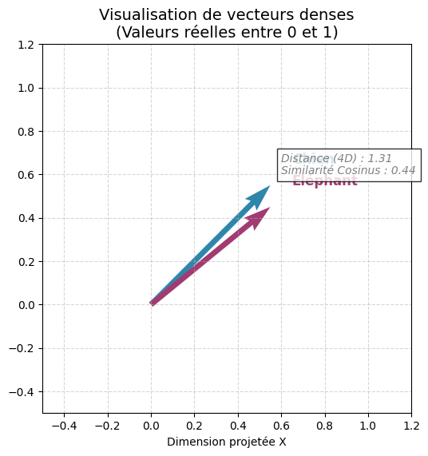

    
# Programme de l'après-midi

PM: (2h30)

- Atelier de nettoyage de corpus (45 minutes) @alexia
- PAUSE (15 min)
- Représentations vectorielles (20 minutes + 40 minutes d'exercice) @alexia
    - BOW
    - TF-IDF
- Classification (15 minutes + 15 minutes de démonstration)
    - RandomForest 
    - LR 
    - etc.

## Nettoyer et structurer un corpus avec des Regex

<!--In a world of human REGEX  plowed-sponge.mp4  -->

Les expressions régulières sont des caractères spéciaux qui turbo-chargent la fonction `Ctrl+F`. 

Les possibilités des regex sont infinies :

- identifier des motifs 
- extraire ('capturer') les motifs
- substituer un motif par un autre

Par conséquent, c'est une forme d'automatisation ou IA symboliste de bas niveaux essentielle pour structurer et nettoyer un corpus textuel avec une grande précision à un coût computationnel très très faible.

## Principes de base des regex 


[Cheat Sheet](https://cheatography.com/davechild/cheat-sheets/regular-expressions/)


## Regex avec Python

Module `re` : 

```
import re 
```


[Documentation](https://docs.python.org/3/library/re.html)


## Atelier Expression régulière ou _Regular Expression_ / Regex

Importer le notebook : 

jour2_regex_exercice.ipynb 

La correction est en HTML : 

jour2_regex_complet.ipynb 


# Pause

## Prétraitement (fin)

Le corpus nettoyé n'est pas directement exploitable par les modèles mathématiques : les chaînes de caractères sont sémantiquement riches mais numériquement inopérantes.

L'étape suivante consiste à transformer ces données textuelles en **représentations numériques vectorielles**. Ce processus convertit le texte en vecteurs de nombres, permettant ainsi des calculs arithmétiques et des comparaisons mathématiques précises.

Exemple de comparaison vectorielle :

- "chien" -> [0, 1, 0, 1, 0]
- "éléphant" -> [1, 0, 0, 0, 0]

Dans cette représentation, l'opération "chien" > "éléphant" (ou toute autre comparaison vectorielle) devient un calcul arithmétique standard, rendant le texte "lisible" par la machine pour la tâche d'apprentissage.


## Repésentation vectorielle : Principes

Un vecteur est une représentation numérique d'une donnée. Le vecteur est une sorte de coordonnée spatiale. 


Exemple : dans un espace à 4 dimensions : 

```
v_chien = np.array([0.8, 0.3, 0.9, 0.2])  # "Chien" : Fort sur les dim 1 et 3
v_elephant = np.array([0.2, 0.9, 0.1, 0.8]) # "Éléphant" : Fort sur les dim 2 et 4
```



Plusieurs principes :

- les vecteurs sont des séries de nombres, dans l'exemple les valeurs sont normalisées (= entre 0 et 1)
- pour pouvoir être comparés, les vecteurs doivent avoir la même longueur

## Comment obtenir un vecteur ?

On compte ! 

### Approche Sac-de-mots/_Bag of Words_


Représentations vectorielles (20 minutes + 40 minutes d'exercice) @alexia
    - BOW
    - TF-IDF
- Classification (15 minutes + 15 minutes de démonstration)
    - RandomForest 
    - LR 
    - etc.


C'est 


## BOW

## TF-IDF

Term Frequency inverse Document Frequency

## Exercice 


## Algorithmes de classification

## Random Forrest

## Logistic Regression

## Bibliographie


   