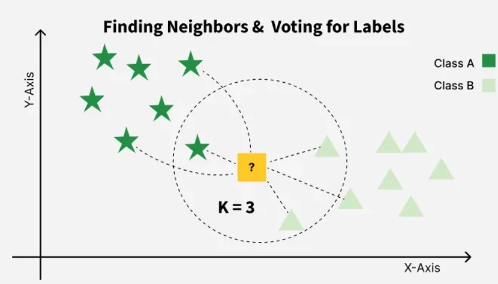
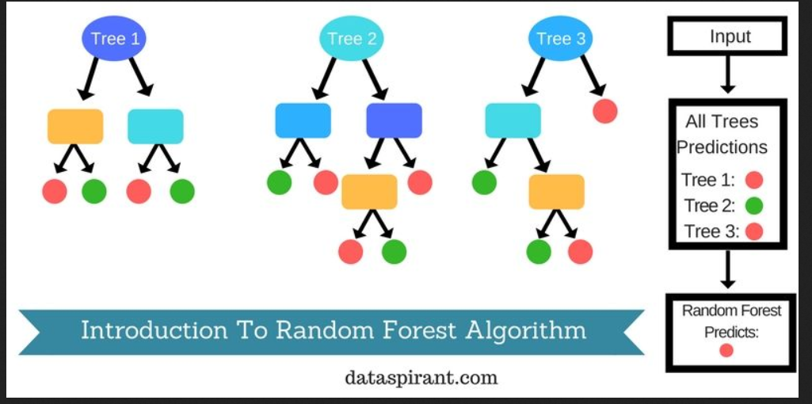
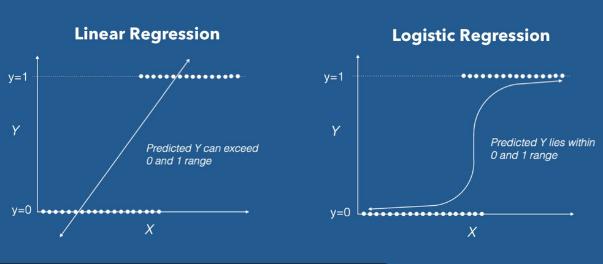

    
# Programme de l'après-midi

PM: (2h30)

- Atelier de nettoyage de corpus (1 heure) 
- PAUSE (15 min)
- Représentations vectorielles (1h15 d'exercice) 
    - BOW
    - TF-IDF
- Classification (15 minutes)
    - KNN
    - RandomForest 
    - LR 

## Nettoyer et structurer un corpus avec des Regex

<!--In a world of human REGEX  plowed-sponge.mp4  -->

Les expressions régulières sont des caractères spéciaux qui turbo-chargent la fonction `Ctrl+F`. 

Les possibilités des regex sont infinies :

- identifier des motifs 
- extraire ('capturer') les motifs
- substituer un motif par un autre

Par conséquent, c'est une forme d'automatisation ou IA symboliste de bas niveaux essentielle pour structurer et nettoyer un corpus textuel avec une grande précision à un coût computationnel très très faible.

## Principes de base des regex 


[Démonstration de base](https://regex101.com/)

[Cheat Sheet](https://cheatography.com/davechild/cheat-sheets/regular-expressions/)


## Regex avec Python

Module `re` : 

```
import re 

```


[Documentation](https://docs.python.org/3/library/re.html)


## Atelier Expression régulière ou _Regular Expression_ / Regex


[https://alexiaschn.github.io/dhsi-2026/notebooks.html](https://alexiaschn.github.io/dhsi-2026/notebooks.html)


Importer le notebook : 

`jour2_regex_exercice.ipynb`

La correction est en HTML : 

`jour2_regex_complet.html`


# Pause

## Prétraitement (fin)

Le corpus nettoyé n'est pas directement exploitable par les modèles mathématiques : les chaînes de caractères sont sémantiquement riches mais numériquement inopérantes.

L'étape suivante consiste à transformer ces données textuelles en **représentations numériques vectorielles**. Ce processus convertit le texte en vecteurs de nombres, permettant ainsi des calculs arithmétiques et des comparaisons mathématiques précises.

Exemple de comparaison vectorielle :

- "chien" -> [0, 1, 0, 1, 0]
- "éléphant" -> [1, 0, 0, 0, 0]

Dans cette représentation, l'opération "chien" > "éléphant" (ou toute autre comparaison vectorielle) devient un calcul arithmétique standard, rendant le texte "lisible" par la machine pour la tâche d'apprentissage.


## Repésentation vectorielle : Principes

Un vecteur est une représentation numérique d'une donnée. Le vecteur est une sorte de coordonnée spatiale. 


Exemple : dans un espace à 4 dimensions : 

```
v_chien = np.array([0.8, 0.3, 0.9, 0.2])  # "Chien" : Fort sur les dim 1 et 3
v_elephant = np.array([0.2, 0.9, 0.1, 0.8]) # "Éléphant" : Fort sur les dim 2 et 4
```


Plusieurs principes :

- les vecteurs sont des séries de nombres, dans l'exemple les valeurs sont normalisées (= entre 0 et 1)
- pour pouvoir être comparés, les vecteurs doivent avoir la même longueur

## Comment obtenir un vecteur ?

On compte ! 

### Approche Sac-de-mots/_Bag of Words_

Exemple : 

Épigramme 1 de notre corpus : "Tu voulais, Héraclide, laisser aux hommes le bruit que tu avais été, une fois mort, changé aux yeux de tous en serpent. Mais tu fus trompé dans tes calculs sophistiques : la bête, en effet, appartenait bien au genre serpent ; toi, tu fus convaicu d'être bête, mais pas du genre sage."

Épigramme 2 du corpus : "« Tu as vécu en chien, Antisthène. - C'est que j'étais né pour déchirer le cœur avec des mots et non avec des crocs. - Mais tu es mort en chien que tu étais né, dira sans doute quelqu'un. - Eh quoi ! il fait bien qu'il y en ait pour servir de guide chez Hadès. »"

Épigramme 3 : ""« Diogène, allons, dis-moi quel destin t'a ravi? - C'est la morsure féroce du Chien, qui m'a ravi chez Hadès. »"

Jusqu'à présent on a vu cette logique : 

token|epigramme1|epigramme2|epigramme3
---|-|-|-|
Tu|oui|oui|non
voulais|oui|non|non
,|oui|oui|oui
Antisthène|non|oui|non
chien|non|oui|oui

On peut voir une nouvelle logique :

épigramme/token|tu|voulais|,|Antisthène|chien
---|--|---|--|----|
1|4|1|8|0|0
2|3|0|2|1|2
3|0|0|3|0|1

## TF-IDF

Term Frequency inverse Document Frequency est une méthode de pondération pour calculer l'importance d'un terme par rapport à l'ensemble d'un corpus.

Calculons le TF-iDF du mot "chien" pour chacun des épigrammes.

On commence par calculer TF (term frequency) soit le nombre d'apparitions du token dans un document en particulier. 

Le mot chien apparait 3 fois dans notre mini corpus de 3 épigrammes et il y a en tout 130 mots (avec un split simple aux espaces) mais 0 fois pour le 1e épigramme, 2 fois pour le 2e et 1 fois dans le 3e.

Donc pour "chien" le TF1 = 0/130, TF2 = 2/130, TF3 = 1/130

Calcul de l'IDF : dans combien de document est-ce que "chien" apparait. 

"chien" apparait dans 2/3 des épigrammes : cette valeur restera la même quel que soit le document.

$$
log3/2
$$

Calcul final : multiplication de TF et IDF pour chacun des épigrammes : 

$$
TFIDF1 = 0/130*log3/2 = 0
$$


$$
TFIDF2 = 2/130*log3/2 = 0.00367016349785
$$


$$
TFIDF3 = 1/130*log3/2 = 0.00183508174892
$$

Le mot "chien" permet sans surprise de discriminer en particulier le deuxième épigramme. 

En recherche d'information on dirait que le deuxième document est le plus pertinent pour le terme "chien". 

Lire sur [wiki](https://fr.wikipedia.org/wiki/TF-IDF)


## Calcul de proximité/distance 

Une application fréquente des vecteurs est le calcul de proximité. 

Ce calcul peut se faire de différentes manières. On trouve :

- Distance L1 ou Manhattan 
- Distance L2 ou euclidienne
- Proximité cosinus


|[Calcul du cosinus d'un angle](img/Cosinus_de_A.svg.png)


Source : [wikipedia distance Manhattan](https://fr.wikipedia.org/wiki/Distance_de_Manhattan) et [wikipedia cosinus](https://fr.wikipedia.org/wiki/Cosinus)


## Exercice 


[https://alexiaschn.github.io/dhsi-2026/notebooks.html](https://alexiaschn.github.io/dhsi-2026/notebooks.html)

`jour2_BoW_TFiDF_exercice.ipynb`


## Algorithmes de classification


La classification est une tâche d'apprentissage supervisé visant à prédire une catégorie (classe) pour une donnée d'entrée.
Nous allons explorer trois approches fondamentales :

1.  **k-Nearest Neighbors (k-NN)** : Une méthode basée sur la proximité immédiate.
2.  **Régression Logistique** : Une méthode statistique pour estimer des probabilités.
3.  **Random Forest (Forêt Aléatoire)** : Une méthode d'ensemble combinant plusieurs modèles.

Ces algorithmes sont les piliers de la classification classique avant d'aborder les réseaux de neurones profonds.


## k-Nearest Neighbors (k-NN)

**Le principe** : "Dis-moi qui sont tes voisins, je te dirai qui tu es."

*   **Fonctionnement** : Pour classifier une nouvelle donnée, on calcule sa distance (ex: Euclidienne) avec toutes les données d'entraînement.
*   **Le paramètre k** : On sélectionne les $k$ voisins les plus proches. La classe prédite est celle qui apparaît le plus souvent parmi ces $k$ voisins (vote majoritaire).
*   **Avantages** : Simple à comprendre, pas de phase d'entraînement explicite (apprentissage paresseux).
*   **Limites** : Lent sur de grands jeux de données, sensible aux données non normalisées et au "bruit".



Source: [Geeksforgeeks](https://www.geeksforgeeks.org/machine-learning/k-nearest-neighbours/)

## Random Forest

*   C'est un algorithme d'ensemble ("Ensemble Learning") basé sur les arbres de décision.
*   **Construction** : On crée de nombreux arbres de décision sur des sous-échantillons aléatoires des données et des features.
*   **Prédiction** : Chaque arbre vote, et la classe retenue est celle qui obtient le plus de votes (bagging).
*   **Avantages** : Très robuste au surapprentissage (overfitting), gère bien les données non linéaires.




## Régression Logistique et Régression linéaire


*   Bien que nommée "régression", elle sert à la classification.
*   Elle modélise la probabilité qu'une donnée appartienne à une classe spécifique à l'aide d'une fonction sigmoïde si logistique et linéaire si régression linéaire.
*   Elle trace une frontière de décision (linéaire ou non linéaire selon les features) pour séparer les classes.
*   **Idéal pour** : Les problèmes linéaires, l'interprétabilité des coefficients.



# Synthèse et Comparaison

| Critère | k-NN | Régression Logistique | Random Forest |
| :--- | :--- | :--- | :--- |
| **Complexité** | Faible (mais calcul lourd à l'inférence) | Faible | Moyenne |
| **Frontière** | Non-paramétrique (locale) | Linéaire (globale) | Non-linéaire (complexe) |
| **Robustesse** | Sensible au bruit et aux features | Sensible aux corrélations | Très robuste |
| **Interprétabilité** | Difficile (boîte noire locale) | Élevée (coefficients) | Moyenne (importance des features) |

**Conclusion** :
*   Utilisez **k-NN** pour des petits jeux de données et une rapidité de mise en œuvre.
*   Utilisez la **Régression Logistique** pour la simplicité et l'interprétabilité.
*   Utilisez **Random Forest** pour la performance et la robustesse sur des problèmes complexes.


   