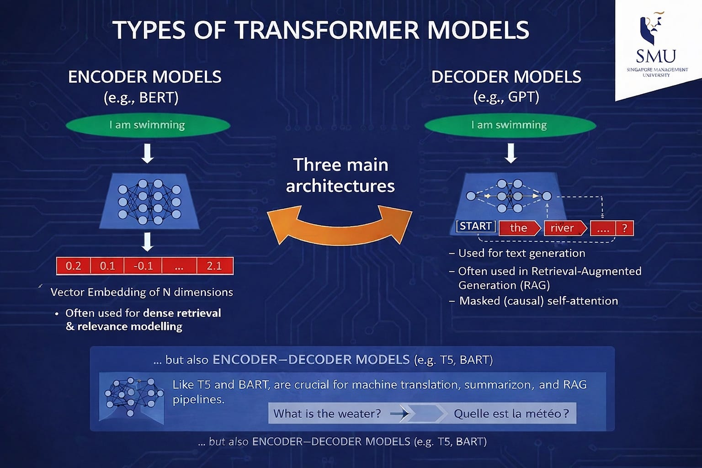
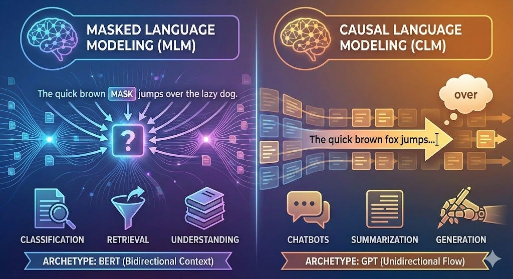
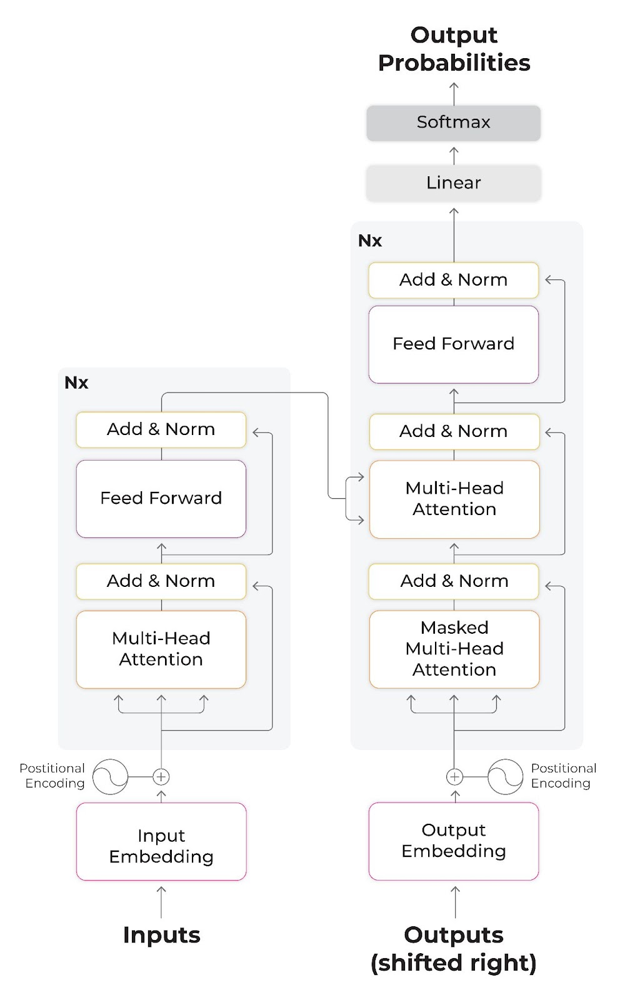

## Programme de la matinée

AM: (3h)
- Présentation des modèles génératifs 1h30
    - Encoder/decoder et masquage
    - Paramétrages d'un LLM génératif 
- PAUSE (15 minutes)
- Classification avec modèles génératifs (1h15) 
    - Prompt engineering avec ChainForge

## Les LLMs 

Hier, nous avons vu les bases de l'apprentissage profond, aujourd'hui, on passe aux grands modèles de langue ou _Large Language Model_.

Il existe en réalité 3 types de LLMs : 

- encodeurs purs, 
- décodeurs purs 
- encodeur-décodeurs

Cette typologie réfère à la façon dont le modèle a été entrainé, et par conséquent à la tâche pour laquelle il est spécialisé à l'inférence (= prédiction).



Source : @tayWhatWeActually2025


## Décodeurs (GPT)

Dans le langage courant ce sont les **IA génératives** : ces modèles font de la prédiction de token suivant (_causal language modelling_). 

Ce sont des modèles auto-régressif : on fournit en entrée au modèle un prompt qui comprend l'instruction du développeur suivi de chaque token produit jusqu'à présent par le modèle. 

Exemple : 

L'utilisateur entre "Quelle est la capitale de la France?"

Le modèle au premier tour reçoit : 

```
"<systemPrompt>Tu es un gentil assistant.</systemPrompt>
<userMessage>Quelle est la capitale de la France ?</userMessage>
```

Le modèle prédit le premier token: "La"

Au deuxième tour le modèle reçoit:

```
"<systemPrompt>Tu es un gentil assistant.</systemPrompt>
<userMessage>Quelle est la capitale de la France ?</userMessage>
<chatMessage>La</chatMessage>
```

Le modèle prédit le token suivant: "capitale"

Au deuxième tour le modèle reçoit:

```
"<systemPrompt>Tu es un gentil assistant.</systemPrompt>
<userMessage>Quelle est la capitale de la France ?</userMessage>
<chatMessage>La capitale</chatMessage>
```


etc. 

Pour déterminer que la prédiction est finie, le modèle prédit un token spécial `<EOF>`


## Encodeurs (BERT)




BERT : Bidirectional Encoder Representation from Transformers

L'entrainement de ces modèles repose sur le masquage de tokens : le modèle généralise à partir d'un encodage bidirectionnel. Leur utilisation est ainsi surtout pour la classification même s'ils peuvent aussi servir à faire de la génération en théorie.


## Encodeur-décodeur (BART)

Partie encodage sert à "comprendre" l'entrée en langue naturelle, partie décodage sert à produire une sortie structurée. Typiquement utilisé pour de la traduction automatique. 


## Comment on obtient un LLM ? 


Ces trois types de modèles de langue ont en commun la manière d'être entrainer. 


Parce qu'il est possible d'entrainer plusieurs fois un modèle, on parle de **pré-entrainement** pour le premier entrainement qui mène au modèle de langue généraliste qu'on nomme un _foundational model_.

Les entrainements suivants servent à **alignemer** le LLM :

- du **reinforcement learning** : des annotateurs évaluent les sorties du modèle, et un apprentissage par renforcement ajuste les préférences du modèle.
- de l'**affinage** ou ***fine-tuning*** s'il s'agit de spécialiser le modèle pour une tâche précise.

### Foundational models : Pré-entrainement

**Constitution d'un corpus non annoté**

**Apprentissage auto-supervisé** : le modèle apprend à prédire le mot suivant ou remplir un blanc dans une phrase.

**Encodage itératif** : chaque mot/token est encodé en vecteur (embeddings) et le réseau ajuste ses poids en fonction du contexte.

Dès cette étape on obtient un modèle généraliste capable de faire des prédictions. 


## Encodage : l'architecture Transformers


Tous les modèles de langue ne sont pas des Transformers mais les Transformers demeurent l'architecture la plus connue et la plus répandue actuellement. 




Encoder les données (à l'entrainement et à l'inférence) passe par plusieurs étapes:

1. embedding : vectorisation selon un nombre défini de dimension (512 pour les BERT). 
2. encodage des positions : les tokens sont traités simultanément alors on conserve la position de chaque token dans la phrase dans l'embedding.  
3. mécanisme d'attention : ajustement des "poids" en fonction de l'importance du token dans la phrase; Création des vecteurs Q, K, V (Query, Key, Value) : Pour chaque mot (représenté par son vecteur), le modèle génère trois nouveaux vecteurs via des matrices de poids apprises :

- Query (Q) : Représente ce que le mot "cherche" dans la phrase.
- Key (K) : Représente ce que le mot "offre" ou contient.
- Value (V) : Contient l'information réelle du mot qui sera utilisée pour la sortie.


Calcul de la pertinence de chaque mot par rapport à un mot cible : produit scalaire entre la Query du mot cible et la Key de tous les autres mots. Cela produit un score de similarité : plus le score est élevé, plus les deux mots sont liés dans ce contexte. Ces scores sont ensuite divisés par une racine carrée (pour stabiliser les gradients) et passés à travers une fonction Softmax. 

Pondération et Somme : Le modèle multiplie chaque vecteur Value (V) de tous les mots par le pourcentage d'attention calculé précédemment. Il somme ensuite ces valeurs pondérées. Le résultat est un nouveau vecteur pour le mot cible : il contient non seulement l'information du mot lui-même, mais aussi une synthèse de toutes les informations des mots qui lui sont liés (ex: pour le mot "banque" dans "je vais à la banque de la rivière", l'attention sera forte sur "rivière" et faible sur "argent", produisant un vecteur qui reflète le sens de "lieu" et non de "finance").

Le processus est répété : plusieurs têtes d'attention servent à identifier des relations de type différents. 


3. Entrainement : les couches d'attention sont passées dans le réseau de neurone et deviennent la première couche de la prochaine étape d'entrainement.

4. (dans le cas des décodeurs) : à l'inférence, la sortie devient l'entrée comme expliqué plus tôt.


[Source](https://arize.com/blog-course/unleashing-bert-transformer-model-nlp/) + explication paraphrasée de Euria. 


## Inférence : paramètrer un décodeur pur

Ces paramètres concernent l'**inférence** et non l'entraînement du modèle.

- Le **seed** (nombre que l'on peut choisir): les LLMs ont une variable aléatoire au moment de l'encodage des données et au moment du requêtage : le seed permet d'utiliser toujours le même ordre aléatoire, càd d'obtenir pour un même prompt toujours la même réponse. Enjeu de reproductibilité. 
- La **température** (valeur de 0 à 1): détermine le degré d'utilisation de la variable aléatoire. Une température élevée signifie que le modèle sera plus "créatif" car il donnera plus probablement un token qui a une probabilité absolue moindre dans son contexte.
- **top_k** (valeur de 0 à 100): variable qui réduit la probabilité de générer des tokens absurdes. Une valeur élevée donne des réponses plus variées et une valeur basse des réponses plus conservatrices. (Défaut 40)
- **top_p** (valeur de 0 à 1): Fonctionne avec le top_k. Une valeur haute donne un texte varié, une valeur basse, un texte conservateur. (Défaut: 0,9)

Source : [Documentation Ollama](https://github.com/ollama/ollama/blob/main/docs/modelfile.md#parameter)


## Model Steering ou System message

Reconduire un modèle consiste à lui fournir des ordres qui vont modifier son comportement pour toutes les interactions suivantes : cette instruction initiale est le "System message". 

[Conduire un modèle interactivement avec Neuronpedia](https://www.neuronpedia.org/gemma-2-9b-it/steer)

## Bonus :  Ollama 

[Téléchargement de Ollama](https://ollama.com/download)

### Utilisation de Ollama en invite de commande

```ollama run llama3.2``` -> télécharge et lance le modèle.

""" -> pour des instructions longues

`/show info` -> information sur le modèle téléchargé

`ollama list` -> liste des modèles téléchargés et utilisables


`ollama rm llama3.2` -> supprime un modèle 

### Steering un model local 

[Tutoriel](https://github.com/ollama/ollama/blob/main/docs/modelfile.md)


Voir : 

``` jour4_steeringLLM_complet.ipynb```


# Pause 

## Travailler avec de l'"IA générative"


Contrairement à certaines des approches qu'on a pu voir les jours précédents, la génération par LLM contient des éléments d'incertitude qui mettent en jeu l'interprétabilité des résultats obtenus :

- probabiliste et stochastique : variable aléatoire peuvent varier les probabilité.
- très large dimension du jeu d'entrainement qui est non annoté -> préférence pour le reinforcement learning plutôt que l'annotation massive à la source. 
- difficile interprétabilité de l'output et de la trace dans les couches neuronales.

Une solution : le _prompt engineering_. 

## Le prompt engineering

Rendre un prompt robuste et surtout permettre l'évaluation systématique d'une stratégie de prompt. Réintégrer une forme de modélisation de son problème pour optimiser un prompt : le template. 


## Éléments de prompt engineering


Tout repose sur l'évaluation des outputs du SIA. Comment passer d'une exploration opportuniste et empirique d'un prompt ou deux au déploiement d'un outil reposant sur un LLM avec un bonne certitude qu'il s'agit d'un système fiable ?

- concevoir des scénarios d'utilisation
- chercher les limites 
- analyser les erreurs
- quantifier l'évaluation -> définir des mesures pertinentes pour la tâche à effectuer

## Typologie d'évaluation 

::: {.incremental}

- Basé sur une référence : comparaison des sorties à partir d'une _ground truth_ 
- reference-free : test libre
- comparaison par paires : comparaison de deux sorties (ex : pour comparer la qualité de deux prompts)
- code-based : évaluation plus robuste 
- LLM-based : peu fiable
- human-evaluation 

:::

## Stratégies de prompt 

- 0 shot
- few shots
- personas
- Chain of Thought (devenu 'reasoning step' inclus dans le LLM )
- formatted outputs 


## Bonnes pratiques


- Décomposer la tâche à effectuer.
- Composer un jeu de donnée a minima : cerner ce à quoi doit ressembler la sortie.
- Partir d'un exemple minimal avant de complexifier la tâche


## ChainForge

[ChainForge](https://chainforge.ai/play/) : outil de comparaison de prompt : comparaison de modèle, comparaison de template (un texte qui inclut des variables) visualisation côte à côte des sorties. 

-> pas à pas de l'utilisation de ChainForge : exemple de la classification binaire en "animal/pas animal"

Vous pouvez suivre et importer le workflow qui se trouve dans les documents de l'onglet Corpus : `flow-classification-animal.cforge`

Les données utilisées sont : `epigrammes_classification_animal.csv`


## Exercice

Vous pouvez vous servir de votre propre jeu de donnée. 

A défaut :

**Effectuer une classification d'épigrammes selon 2 genres proches : Romantique / Érotique**

Commencez par un New Flow, et ajouter la clé API (soit la vôtre soit la clé Together AI fournie) dans les paramètres. 

Télécharger dans le corpus le jeu de données `epigramme_classification.csv`


1.Ajouter les données avec l'import CSV. -> Add Node > tabular Data 
2. Formuler 2 variants d'un prompt, pensez aux différentes stratégies de prompt existantes (persona, Chain of Thought).  -> Add Node > Prompt Node

Tips : pour faire passer une variable d'un _node_ de CSV à celui de prompt il faut mettre la variable (le nom de la colonne) entre curly braces {}


3. Ajouter un ou deux modèles maximum et inspecter les prompts envoyer avant de les envoyer.

Si vous utilisez la clé API fournie, vous ne pourrez utiliser que les modèles : 

- togetherAI/Qwen2.5-7B-Instruct-Turbo
- togetherAI/Llama-3.3-70B-Instruct-Turbo


4. Ajouter 2 évaluateurs LLM : le premier pour déterminer la qualité de la classification sur une échelle de 1 à 10. le second donnera une évaluation en True/False de la qualité de la classification. Ex "Donne une note de 1 à 10 sur la qualité de la classification : le modèle dont tu évalues la réponse devait déterminer si le texte suivant {épigramme} était romantique ou érotique".

Tips : pour faire passer la variable du node CSV à l'évaluateur il faut utiliser la syntaxe : `response.meta['variable']`

5. Comparer la qualité des sorties des différents prompts et la qualité des évaluations par les LLM. 


Tips : 

- pour faire passer une variable d'un _node_ de CSV à celui de prompt il faut mettre la variable (le nom de la colonne) entre curly braces {}
- pour faire passer la variable du node CSV à l'évaluateur il faut utiliser la syntaxe : `response.meta['variable']`


