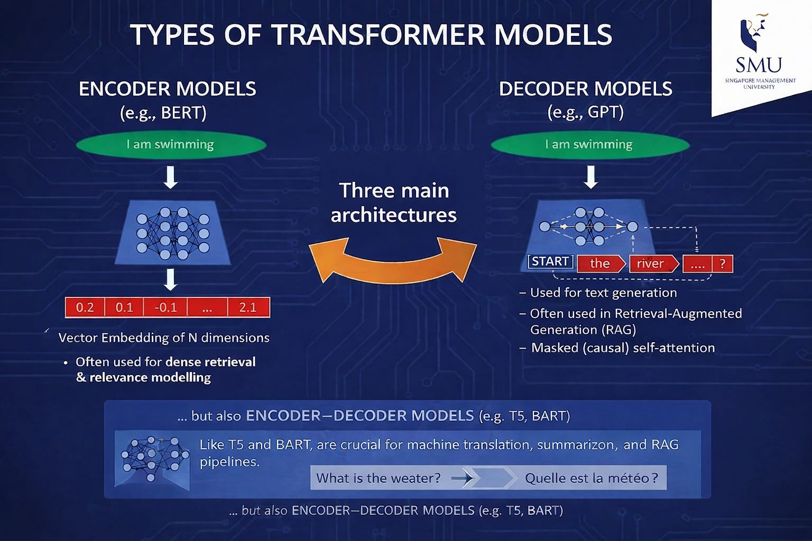
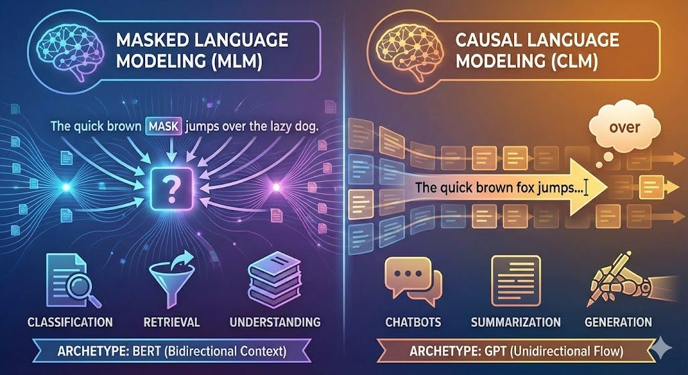
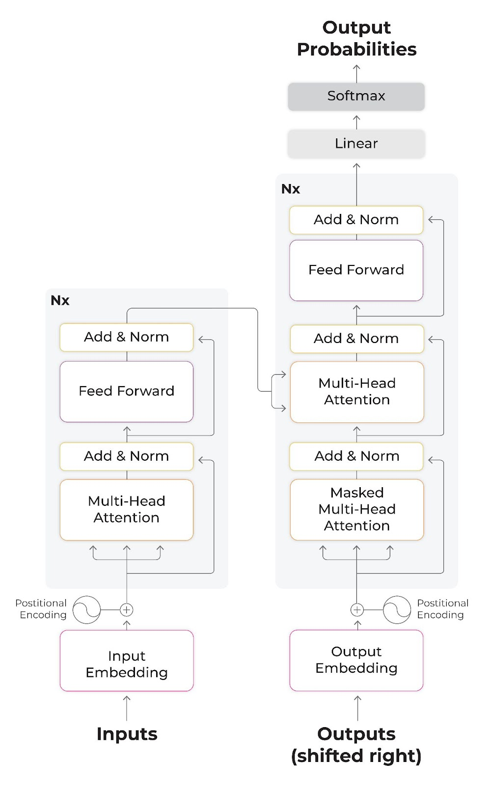
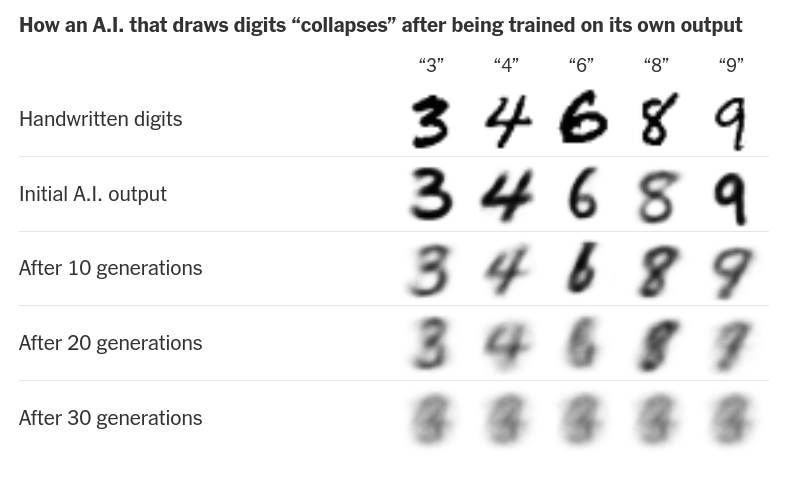
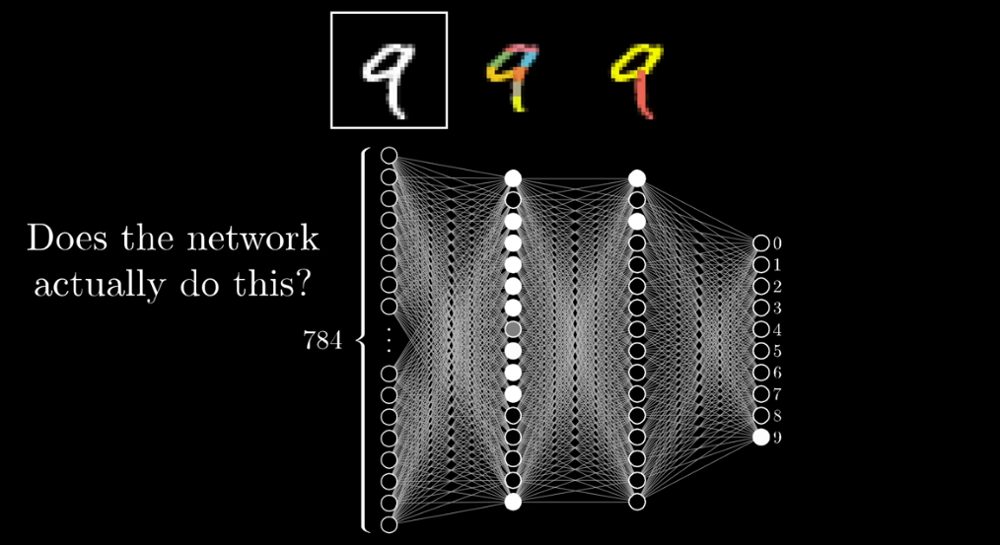
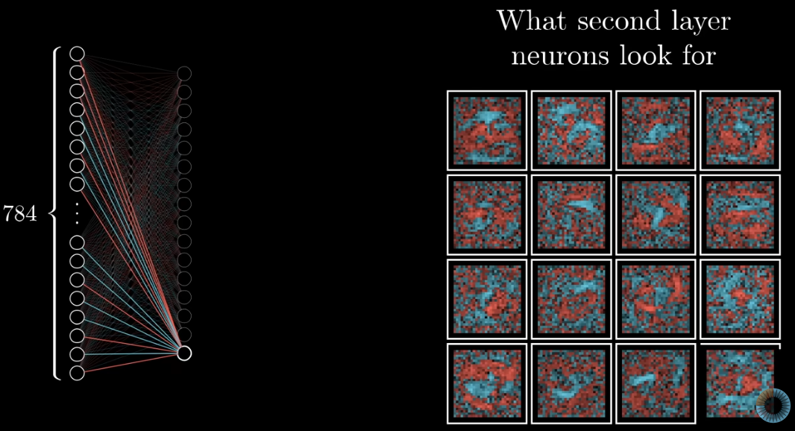
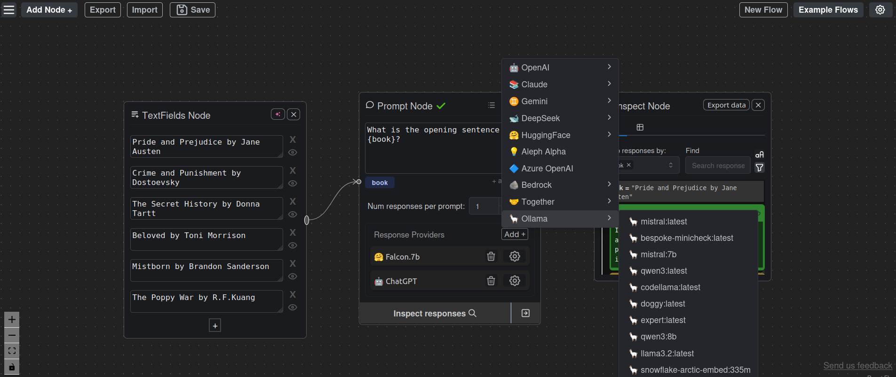

## Programme de la matinée

AM: (3h)

- Présentation des modèles génératifs (30min)
    - Typologie des LLMs
    - Paramétres d'un LLM génératif pour l'inférence,
- Exercices (1h)
    - Piloter un modèle avec Neuronpédia
    - Utiliser un LLM localement
    - Piloter un modèle en local
- PAUSE (15 minutes)
- Classification avec modèles génératifs (1h15) 
    - Prompt engineering avec ChainForge

## Les LLMs 

Hier, nous avons vu les bases de l'apprentissage profond, aujourd'hui, on passe aux grands modèles de langue ou _Large Language Model_.

Il existe en réalité 3 types de LLMs : 

- encodeurs purs, 
- décodeurs purs 
- encodeur-décodeurs

Cette typologie réfère à la façon dont le modèle a été entrainé, et par conséquent à la tâche pour laquelle il est spécialisé à l'inférence (= prédiction).



Source : @tayWhatWeActually2025


## Décodeurs (GPT)

Dans le langage courant ce sont les **IA génératives** : ces modèles font de la prédiction de token suivant (_causal language modelling_). 

Ce sont des modèles auto-régressifs : on fournit en entrée au modèle un prompt qui comprend l'instruction du développeur suivi de chaque token produit jusqu'à présent par le modèle. 

Exemple : 

L'utilisateur entre "Quelle est la capitale de la France?"

Le modèle au premier tour reçoit : 

```
"<systemPrompt>Tu es un gentil assistant.</systemPrompt>
<userMessage>Quelle est la capitale de la France ?</userMessage>
```

Le modèle prédit le premier token: "La"

Au deuxième tour le modèle reçoit:

```
"<systemPrompt>Tu es un gentil assistant.</systemPrompt>
<userMessage>Quelle est la capitale de la France ?</userMessage>
<chatMessage>La</chatMessage>
```

Le modèle prédit le token suivant: "capitale"

Au deuxième tour le modèle reçoit:

```
"<systemPrompt>Tu es un gentil assistant.</systemPrompt>
<userMessage>Quelle est la capitale de la France ?</userMessage>
<chatMessage>La capitale</chatMessage>
```


etc. 

Pour déterminer que la prédiction est finie, le modèle prédit un token spécial `<EOF>`


## Encodeurs (BERT)




Source : @tayWhatWeActually2025

BERT : Bidirectional Encoder Representation from Transformers

L'entrainement de ces modèles repose sur le masquage de tokens : le modèle généralise à partir d'un encodage bidirectionnel. Leur utilisation est ainsi surtout pour la classification même s'ils peuvent aussi servir à faire de la génération en théorie.


## Encodeur-décodeur (BART)

Partie encodage sert à "comprendre" l'entrée en langue naturelle, partie décodage sert à produire une sortie structurée. Typiquement utilisé pour de la traduction automatique. 


## Comment on obtient un LLM ? 


Ces trois types de modèles de langue ont en commun la manière d'être entrainé. 


Parce qu'il est possible d'entrainer plusieurs fois un modèle, on parle de **pré-entrainement** pour le premier entrainement qui mène au modèle de langue généraliste qu'on nomme un _foundational model_.

Les entrainements suivants servent à **aligner** le LLM :

- du **reinforcement learning** : des annotateurs évaluent les sorties du modèle, et un apprentissage par renforcement ajuste les préférences du modèle.
- de l'**affinage** ou ***fine-tuning*** s'il s'agit de spécialiser le modèle pour une tâche précise.

## Foundational models : Pré-entrainement

**Constitution d'un corpus non annoté**

**Apprentissage auto-supervisé** : le modèle apprend à prédire le mot suivant ou remplir un blanc dans une phrase.

**Encodage itératif** : chaque mot/token est encodé en vecteur (embeddings) et le réseau ajuste ses poids en fonction du contexte.

Dès cette étape on obtient un modèle généraliste capable de faire des prédictions. 


## Encodage : l'architecture Transformers


Tous les modèles de langue ne sont pas des Transformers mais les Transformers demeurent l'architecture la plus connue et la plus répandue actuellement. 




Encoder les données (à l'entrainement et à l'inférence) passe par plusieurs étapes:

1. embedding : vectorisation selon un nombre défini de dimensions (512 pour les BERT). 
2. encodage des positions : les tokens sont traités simultanément alors on conserve la position de chaque token dans la phrase dans l'embedding.  
3. mécanisme d'attention : ajustement des "poids" en fonction de l'importance du token dans la phrase; Création des vecteurs Q, K, V (Query, Key, Value) : Pour chaque mot (représenté par son vecteur), le modèle génère trois nouveaux vecteurs via des matrices de poids apprises :

- Query (Q) : Représente ce que le mot "cherche" dans la phrase.
- Key (K) : Représente ce que le mot "offre" ou contient.
- Value (V) : Contient l'information réelle du mot qui sera utilisée pour la sortie.


Calcul de la pertinence de chaque mot par rapport à un mot cible : produit scalaire entre la Query du mot cible et la Key de tous les autres mots. Cela produit un score de similarité : plus le score est élevé, plus les deux mots sont liés dans ce contexte. Ces scores sont ensuite divisés par une racine carrée (pour stabiliser les gradients) et passés à travers une fonction Softmax (distribution des probabilités). 

Pondération et Somme : Le modèle multiplie chaque vecteur Value (V) de tous les mots par le pourcentage d'attention calculé précédemment. Il somme ensuite ces valeurs pondérées. Le résultat est un nouveau vecteur pour le mot cible : il contient non seulement l'information du mot lui-même, mais aussi une synthèse de toutes les informations des mots qui lui sont liés (ex: pour le mot "banque" dans "je vais à la banque de la rivière", l'attention sera forte sur "rivière" et faible sur "argent", produisant un vecteur qui reflète le sens de "lieu" et non de "finance").

Le processus est répété : plusieurs têtes d'attention servent à identifier des relations de type différents. 


3. Entrainement : les couches d'attention sont passées dans le réseau de neurone et deviennent la première couche de la prochaine étape d'entrainement.

4. (dans le cas des décodeurs) : à l'inférence, la sortie devient l'entrée.


[Source](https://arize.com/blog-course/unleashing-bert-transformer-model-nlp/) + explication paraphrasée de Euria. 


## Inférence : paramètrer un décodeur pur

Ces paramètres concernent l'**inférence** et non l'entraînement du modèle.

- Le **seed** (nombre que l'on peut choisir): les LLMs ont une variable aléatoire au moment de l'encodage des données et au moment du requêtage : le seed permet d'utiliser toujours le même ordre aléatoire, càd d'obtenir pour un même prompt toujours la même réponse. Enjeu de reproductibilité. 
- La **température** (valeur de 0 à 1): détermine le degré d'utilisation de la variable aléatoire. Une température élevée signifie que le modèle sera plus "créatif" car il donnera plus probablement un token qui a une probabilité absolue moindre dans son contexte.
- **top_k** (valeur de 0 à 100): variable qui réduit la probabilité de générer des tokens absurdes. Une valeur élevée donne des réponses plus variées et une valeur basse des réponses plus conservatrices. (Défaut 40)
- **top_p** (valeur de 0 à 1): Fonctionne avec le top_k. Une valeur haute donne un texte varié, une valeur basse, un texte conservateur. (Défaut: 0,9)
- **pénalité de fréquence** (de -2.0 à 2.0):  applique une pénalité proportionnelle au nombre de fois où un token est apparu dans le prompt et dans la réponse. Une pénalité de fréquence élevée signifie qu'un token n'apparaitrait pas plusieurs fois : empêche la répétition. 
 

Source : [Documentation Ollama](https://github.com/ollama/ollama/blob/main/docs/modelfile.md#parameter)

## Piloter un modèle _"Steering"_ et _System message_

Piloter un modèle consiste à lui fournir des ordres qui vont modifier son comportement pour toutes les interactions suivantes : cette instruction initiale est le "System message". 

- **steering vector** : La plupart des méthodes de pilotage ajoutent un « vecteur de pilotage » (SV) aux activations du modèle à une couche et une position de token données lors de l'inférence. Cette approche s'appuie sur l'hypothèse selon laquelle de nombreux concepts interprétables par les humains, tels que l'honnêteté, le refus et le sentiment, sont représentés sous forme de directions dans l'espace des activations. --- Source : [https://joschkacbraun.github.io/assets/pdf/steering_blog_post.pdf](https://joschkacbraun.github.io/assets/pdf/steering_blog_post.pdf)

[Conduire un modèle interactivement avec Neuronpedia](https://www.neuronpedia.org/gemma-2-9b-it/steer)

## Travailler en local avec un LLM

Avantages : 

- Les échanges restent privés, 
- Pas besoin de connexion internet,
- Plus simple de bidouiller le modèle par soi-même,
- Possibilité de travailler avec des modèles très différents sans passer par des plateformes propriétaires.

Désavantages : 

- Limites = les capacités de son ordinateur, 
- Pas de mémoire des interactions précédentes,
- Pas d'accès à d'autres modules complémentaires comme sur une application type ChatGPT ou Mistral.ai (ex: recherche sur internet, ajout de documents, connexion avec son agenda etc. )

NB : Travailler en local ne signifie pas que le modèle a accès aux documents sur votre ordinateur : il s'agit d'un programme indépendant. 

# Préparation pour la suite de la journée

## Installation d'Ollama 

Ollama permet de télécharger des modèles de langue en local et d'intérargir avec. 

1. Ouvrir son terminal : 

- sur Windows : Chercher `PowerShell`
- sur MacOS : `Command` + `espace` ouvre Spotlight search : chercher "terminal"

2. Entrer en ligne de commande : 

- Windows : `irm https://ollama.com/install.ps1 | iex`
- MacOS/Linux :  `curl -fsSL https://ollama.com/install.sh | sh`

ou [Télécharger Ollama depuis leur site](https://ollama.com/download)

3. Télécharger et lancer un modèle: 

Liste des LLM disponibles : [https://ollama.com/search](https://ollama.com/search) : **llama3.2 pèse 2Go** c'est un des plus petit.

```ollama pull llama3.2:latest``` -> télécharge le modèle.

```ollama run llama3.2``` -> lance le modèle.

("" -> pour des instructions longues)

4. Couper la génération : `Ctrl` + `c` et couper le programme : `Ctrl` + `d`

Autres commandes : 

`/show info` -> information sur le modèle téléchargé

`ollama list` -> liste des modèles téléchargés et utilisables

`ollama rm llama3.2` -> supprime un modèle 


### Téléchargement local de Chainforge 

En ligne de commande : 

Activer son environnement virtuel (environnement Python dédié): 

> `source .venv/bin/activate`

Télécharger ChainForge:

- Linux/MacOS : `pip install --global chainforge`
- Windows : `py -m pip install --global chainforge`


## Exercice 

[Neuronpedia piloter un modèle](https://www.neuronpedia.org/gemma-2-9b-it/steer) commencez par partir d'une démonstration proposée : 

Modifier un paramètre, et poser une question entre chaque modification :

- température : valeur entre 0 et 1
- freq. penalty (pénalité de fréquence) : valeur entre -2 et 2
- strength multiple (force du pilotage) : valeur entre 0 et 10

Ajouter une feature (une caractéristique) (ex : dogs, dishonesty) et modifier à nouveau les paramètres à chaque tour.  

### Piloter un modèle local 

<!-- Pour le faire en Python : 

``` jour4_steeringLLM_complet.ipynb``` -->

En ligne de commande : 

1. Télécharger le document, le mettre dans le dossier de votre choix "ModelFile" sur le site à l'onglet Corpus : [Lien](https://alexiaschn.github.io/dhsi-2026/corpus.html). 

Modifier les paramètres et le System Prompt à souhait.

2. Se déplacer dans le dossier où se trouve le document "ModelFile" : 

Exemple pour le dossier des Téléchargement:

    Windows (PowerShell ou CMD) : ```cd Downloads``` (ou ```cd Téléchargements``` si le système est en français).
    Linux : ```cd ~/Téléchargements``` (ou ```cd ~/Downloads``` si le système est en anglais).
    macOS : ```cd ~/Downloads.``` 

3. Créer un nouveau modèle piloté : le mot 'chien' peut être remplacé par un autre nom.

```ollama create chien -f ModelFile```

4. Lancer le modèle piloté en utilisant le nom donné.

```ollama run chien```

# Pause 

## Travailler avec de l'"IA générative"

Contrairement à certaines des approches qu'on a pu voir les jours précédents, la génération par LLM contient des éléments d'incertitude qui mettent en jeu l'interprétabilité des résultats obtenus :

- probabiliste et stochastique : variable aléatoire font varier les probabilités et donc les réponses [@benderDangersStochasticParrots2021]
- Les modèles sont a priori pré-déterminé par leurs données d'entrainement (= préférence pour le _reinforcement learning_ plutôt que l'annotation massive à la source).
    - Entraînenement sur des données synthètique provoque l'effondrement du modèle [@shumailovAIModelsCollapse2024].



- difficile interprétabilité de l'output et de la trace dans les couches neuronales. ExplainableAI est une discipline à part entière. Exemple d'une analyse de trace à l'intérieur du modèle : [Neuronpedia](https://www.neuronpedia.org/gemma-2-2b/graph)





Source : @3blue1brownMaisCestQuoi2017


## Le prompt engineering

Une solution : le _prompt engineering_. 


Rendre un prompt robuste et surtout permettre l'évaluation systématique d'une stratégie de prompt. Réintégrer une forme de modélisation de son problème pour optimiser un prompt. Le prompt engineering consiste à obtenir le meilleur "_template_" d'instruction pour résoudre un problème avec comme objectif l'adaptabilité à des situations variées et la cohérence des réponses au fur et à mesure des itérations.


## Éléments de prompt engineering

Comment passer d'une exploration opportuniste et empirique d'un prompt ou deux au déploiement d'un outil reposant sur un LLM avec un bonne certitude qu'il s'agit d'un système fiable ?

- concevoir des scénarios d'utilisation
- chercher les limites 
- analyser les erreurs
- quantifier l'évaluation -> définir des mesures pertinentes pour la tâche à effectuer

## Typologie d'évaluation 

::: {.incremental}

- Basé sur une référence : comparaison des sorties à partir d'une vérité de terrain (=_ground truth_)
- _Reference-free_ : Sans vérité de terrain pour effectuer l'évaluation 
- Comparaison par paires : comparaison de deux sorties (ex : pour comparer la qualité de deux prompts)
- Code-based : évaluation plus robuste car basée sur une quantification de l'évaluation (ex: si on demande d'effectuer une synthèse d'un texte, s'assurer que le texte de sortie contient moins de mots que le texte à synthétiser est quantifiable).
- LLM-based : Demander à un LLM d'évaluer la sortie. 
- Évaluation humaine : prend du temps, mais obligatoire même à moindre échelle. 

:::

## Stratégies de prompt 

- 0 shot : pas d'exemple, instruction brute.
- few shots : ajout d'exemples. -> la stratégie la plus robuste [@brownLanguageModelsAre2020]
- personas : instruction de comportement.
- Chain of Thought (devenu 'reasoning step' inclus dans le LLM ) : "
- Formatted outputs : demander une sortie dans un format structuré guide les LLMs (ex: JSON)


## Bonnes pratiques


- Décomposer la tâche à effectuer.
- Composer un jeu de donnée a minima : cerner ce à quoi doit ressembler la sortie.
- Partir d'un exemple minimal avant de complexifier la tâche
- Préférer les exemples aux instructions.
- Demander une sortie dans un format qui demande un schéma de validation pour éviter les erreurs.


## ChainForge

[ChainForge](https://chainforge.ai/play/) : outil de comparaison de prompt : comparaison de modèle, comparaison de template (un texte qui inclut des variables) visualisation côte à côte des sorties. 

Démonstration de l'utilisation de ChainForge : exemple de la classification binaire en "animal/pas animal"

Vous pouvez suivre et importer le workflow qui se trouve dans les documents de l'onglet Corpus : `flow-classification-animal.cforge`

Les données utilisées sont : `epigrammes_classification_animal.csv`


## Lancer ChainForge et Ollama en local : 

> `chainforge serve`


Lancer Ollama : 

> `ollama serve`

Si vous avez une erreur "Error: listen tcp 127.0.0.1:11434: bind: address already in use" : 

Linux/MacOS : ```sudo systemctl stop ollama``` / Windows : ```net stop ollama```

Le localhost (par défaut http://localhost:8000/) devrait maintenant proposer dans les Nodes de Prompt le type 'ollama'. 



## Exercice 

Vous pouvez vous servir de votre propre jeu de donnée. 

A défaut :

**Effectuer une classification d'épigrammes selon 2 classes : Hétérosexuel / Homosexuel**

Commencez par un New Flow. 

Télécharger dans le corpus le jeu de données `erotiques_anthologia_graeca_fr.csv`

1.Ajouter les données avec l'import CSV. -> Add Node > tabular Data 
2. Formuler 2 variants d'un prompt, pensez aux différentes stratégies de prompt existantes (persona, Chain of Thought).  -> Add Node > Prompt Node

Tips : pour faire passer une variable d'un _node_ de CSV à celui de prompt il faut mettre la variable (le nom de la colonne) entre curly braces {}. Exemple : "Est-ce que le texte suivant parle d'une relation homosexuelle ou hétérosexuelle ? Texte : {text_fr} "


3. Ajouter un ou deux modèles (Ollama) maximum et **inspecter les prompts avant de les envoyer**.

<!-- Si vous utilisez la clé API fournie, vous ne pourrez utiliser que les modèles : 

- togetherAI/Qwen2.5-7B-Instruct-Turbo
- togetherAI/Llama-3.3-70B-Instruct-Turbo -->


4. Ajouter 2 évaluateurs : 

- le premier pour quantifier les réponses en Python ou en Javascript (déterminer avec True or False si la réponse était bien celle attendue). 
- le deuxième est une évaluation 'LLM-as-judge' : le LLM devra déterminer si l'évaluation était correcte en comparant la réponse donnée et la réponse attendue.


Tips : pour faire passer la variable du node CSV à l'évaluateur il faut utiliser la syntaxe : `response.meta['variable']` ex : "Donne une note de 1 à 10 sur la qualité de la classification : le modèle dont tu évalues la réponse devait déterminer si le texte suivant "{response.meta['text_fr']}" était romantique ou érotique"

5. Comparer la qualité des sorties des différents prompts et la qualité des évaluations par les LLM. 

- pour faire passer une variable d'un _node_ de CSV à celui de prompt il faut mettre la variable (le nom de la colonne) entre curly braces {}
- pour faire passer la variable du node CSV à l'évaluateur il faut utiliser la syntaxe : `response.meta['variable']`

## Questions liées à l'exercice

Quel est le meilleur modèle ? 

Quel est le meilleur prompt ? 

Observez les erreurs produites par les modèles, quels facteurs semblent avoir confondus les modèles ? Quels sont les biais des modèles ? Ces biais sont-ils exprimés explicitement dans les phases de réflexions du modèle ?  

Quelles sont les limites de cette stratégie de classification ?

Quelles sont les limites de l'évaluation de la classification ? 

Quelles autres critères peut-on envisager pour cette classification automatique ? 


## Bibliographie