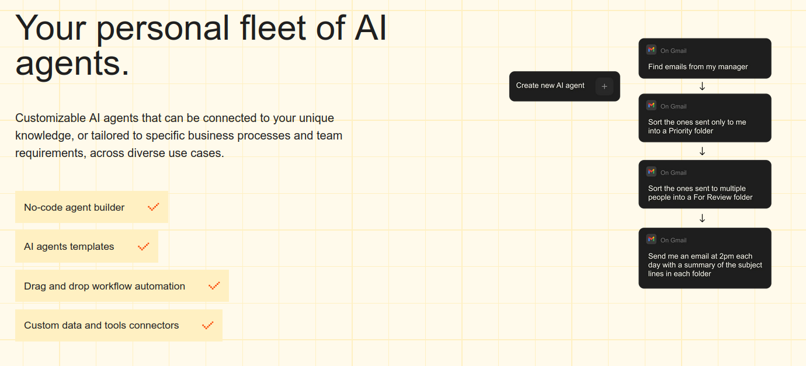
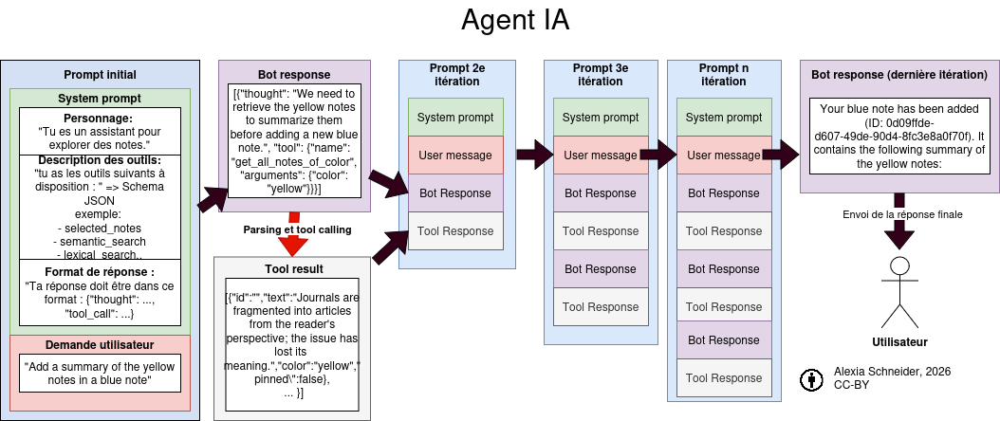
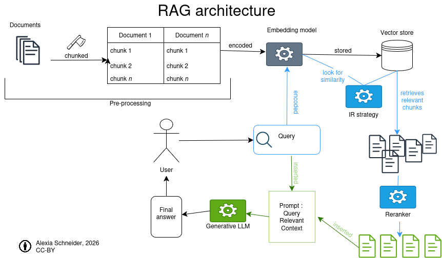

## Programme de la matinée

AM:

- Présentation des systèmes complexes intégrants des IA agentiques et des RAG (45 min)
- (60 minutes) 
- PAUSE (15 minutes)
- Discussion (1h) 
    - Enjeux en SHS 
    - Conclusion 

## Objectifs de la matinée 

- Comprendre le processus de traitement des instructions utilisateurs par les applications à bases de LLM
- Faire le point sur les enjeux propres aux SHS de ces applications 
- Résumé de la semaine et discussions

## Les architectures complexes de Systèmes à base d'"IA générative"

Nous avons abordé avec le prompt engineering la complexité de l'intégration d'un LLM génératif dans un programme dont on souhaiterait maîtriser les sorties de manière fiable et robuste. 

## Quelle complexité ?

IA, dite générative ou d'automatisation de la prédiction de token, effectue aujourd'hui des tâches complexes à deux niveaux: 

- **interprétation** d'une instruction donnée en langue naturelle (avec son lot d'ambiguïté).
- **intégration** de LLM dans des process ou pipelines qui impliquent des interactions en chaînes pour traiter une demande : 

    - Systèmes agentiques "_agentic AI_"
    - RAG


## Applications de clavardage actuelles

ChatGPT d'OpenAI, Claude d'Anthropic, Le Chat de Mistral etc. sont des **applications qui interagissent avec un LLM** (GPT5.2, Mistral). Ce qui est envoyé comme requête est appelé un prompt. Le prompt ne contient pas que la requête de l'utilisateur.ice.

Dans ce prompt, on trouve un ensemble d'instructions préliminaires (le _system prompt_) et d'informations complémentaires comme l'historique des échanges (_chat history_). 

Depuis décembre 2024, le Model Context Protocol (MCP) permet l'**intégration modulaire de l'interface de chat à d'autres fonctionalités** des applications grands publics de chat -> interaction avec un agenda sur le cloud, les API de sites marchands ou de sites de nouvelles, recherche sur un moteur de recherche.

## MCP 

![Le MCP[^mcp]](img/mcp.png)


[^mcp]: source: https://modelcontextprotocol.io/docs/getting-started/intro 

Le MCP est un premier pas vers la standardisation des échanges entre les applications avec une visée d'autonomie des systèmes. En partie, c'est un protocole qui repose sur la standardisation du JSON-RCP (standardisation des clés) : (JavaScript Object Notation-Remote Procedure Call). 


## Les agents IA

Renvoie à la notion d'**autonomie**, d'agentivité : narratif promethéen promut par les entreprises de la Big Tech.  

En réalité : Un agent est un enchaînement d'appels à un LLM. 

L'agent est ce qui permet d'**intégrer à un prompt des informations complémentaires de manière asynchrone**. Informations que le LLM aura solicitées après analyse de la demande entrées par l'utilisateur.ice. 

Autrement dit, **un agent est une "IA" qui se répond à elle-même.** 


## Définition hypée des IA agentiques

![Description des IA agentiques par Docker [@irwinGenAIVsAgentic2025]](img/genai_v_agenticai.png)

---


L'agent a pour objectif de compléter une tâche de manière "autonome" c'est-à-dire sans intervention d'un humain, sans relance de l'utilisateur ou du dev. On parlera de système agentique quand plusieurs agents interagissent. 





Il existe plusieurs architectures permettant de spécialiser des agents : orchestration par un LLM, architecture séquentielle ou parallèle, design en boucle etc.

## Schéma de l'architecture d'un agent IA



# Exemple 

---

Analyse de la demande utilisateur, étape 1 : 

partie du prompt|contenu|
----|-------|
Prompt system : orientation globale | "Tu es un gentil assistant, tu réponds toujours poliment. Analyse la requête de l'utilisateur. 
Prompt sytem : Description des outils| Tu disposes des outils suivants pour améliorer la qualité de tes réponses: Outil 1 : recherche sur internet. Outil 2 : calculatrice addition, Outil 3 : calculatrice soustraction. 
Prompt system: Orientation du formattage de la réponse | Tu répondras toujours avec tes pensées dans la balise `<pensée>` et chaque outil dans une balise `<outil>`. Ta réponse finale sera dans une balise `<reponse>`"
Prompt utilisateur| "Comment télécharger ChainForge ?"

---

Réponse du LLM à l'étape 1: 

>`<pensée>`L'utilisateur veut savoir comment télécharger ChainForge. Je vais lancer une recherche sur internet.`</pensée><Outil>`recherche sur internet : "ChainForge téléchargement"`</outil>`

--- 

Parsing de la réponse : extraction du contenu de la balise `<outil>` : lancement de la fonction de recherche d'information avec la requête spécifiée. 

```
rechercheInternet(requete) : 

  return google(requete)
``` 

>Site 1 :  "chainforge.ai " ,   Site 2 : stackoverflow.com 
---


Intégration des informations au prompt, étape 2: 

partie du prompt|contenu|
----|-------|
Prompt system : orientation globale | "Tu es un gentil assistant, tu réponds toujours poliment. Analyse la requête de l'utilisateur. 
Prompt sytem : Description des outils| Tu disposes des outils suivants pour améliorer la qualité de tes réponses: Outil 1 : recherche sur internet. Outil 2 : calculatrice addition. Outil 3 : calculatrice soustraction. 
Prompt system: Orientation du formattage de la réponse | Tu répondras toujours avec tes pensées dans la balise `<pensée>` et chaque outil dans une balise `<outil>`. Ta réponse finale sera dans une balise `<reponse>`"
Prompt utilisateur| "Comment télécharger ChainForge?"
**Retour de la requête**| Site 1 :  "chainforge.ai " ,   Site 2 : stackoverflow.com  

---

Réponse du LLM à l'étape 2: 

>`<pensée>`Les sources indiquent qu'il faut installer sous forme de module Python.`</pensée><reponse>`Pour télécharger ChainForge il faut avoir installer Python et entrer en ligne de commande pip install chainforge.`</reponse>`

---

Parsing de la réponse : extraction de la réponse finale dans la balise `<reponse>` : transmission de son contenu à l'utilisateur.ice.

>our télécharger ChainForge il faut avoir installer Python et entrer en ligne de commande pip install chainforge.


---

Du point de vue utilisateur.ice :


"Comment télécharger ChainForge ?" -> Sur .


- Masquage du traitement de la demande : enchaînement silencieux, multiplication des couches interprétatives.
- Repose sur des fonctions de parsing ou déchiffrage : on peut inciter un LLM à générer dans un format structuré, mais les réponses restent probabilistes et non déterministes -> les balises ne sont pas respectées, le modèle 'hallucine' des outils qui n'existent pas, etc. On en revient à nos vieilles Regex : 

Claude pré-traite toutes les requêtes utilisateur.ices avec : 

``` 
/\b(wtf|wth|ffs|shit(ty)?|dumbass|horrible|awful|
piss(ed|ing)? off|piece of (shit|crap)|what the (fuck|hell)|
fucking? (broken|useless|terrible)|fuck you|screw (this|you)|
so frustrating|this sucks|damn it)\b/
```

# RAG

##  RAG : Retrieval Augmented Generation

Limites du LLM: 

- représentation figée sur les données d'entraînement (= mémoire implicite ne peut pas être mise à jour)
- fenêtre contextuelle limitée (ajd jusque 120 000 tokens, en réalité déclin après ~30 000 tokens) 

-> **perte de fiabilité**

Le RAG : architecture de système d'IA qui repose sur une base de connaissance externe dans le but d'améliorer les réponses d'une IA générative sans demander d'entrainement supplémentaire (_fine tuning_).[@lewisRetrievalAugmentedGenerationKnowledgeIntensive2021] (Facebook, University College London, New York University)

Le but fondamental est d'obtenir une synthèse de plusieurs sources dans le cas où le nombre de document est trop grand pour pouvoir rentrer dans le prompt. 

---



## RAG en bref

Requête d'une base de données[^note] avec des méthodes de Recherche d'Information (TF-iDF ou similarité cosinus) + intégration des morceaux extraits au prompt. Le LLM effectue une synthèse. 

[^note]: ou d'un moteur de recherche

## Points d'attention sur le RAG

- Jeux de données externes peut aussi être biaisé,
- Ajout de couches d'interprétation,
- Dissémination de l'information quand l'information se trouve dans plusieurs chunks,
- Angles morts quand l'information importante est dans un chunk non extrait.


## Quels sont les enjeux de l'IA pour les SHS ? 

<!-- ajouter des questions qui peuvent lancer un débat ici -->

- Avec l'ancrage de nouvelles "pratiques discrètes" [@mullerPoussiereLumiereBleue2021] de l'IA , on assiste à une nouvelle phase : exemple de la correction comme écriture mais aussi comme masquage de l'utilisation d'IA générative. 


- Les promesses de gain de temps et de productivité cachent des enjeux économiques forts : on ne peut que rester méfiants face aux biais de ces outils tout en prennant conscience de ses propres influences. 


# Pause (15min)

# Résumé de la semaine 

## Jour 1

Introduction théorique, histoire de l'"IA". 

À retenir : 

- L'histoire de l'IA est connectée à celle du développement des mathématiques (algorithmie) et des outils de calculs : une longue histoire dont on peut questionner la narration.
- Le terme d'IA est galvaudé : c'est une notion floue appliquée à des technologies très différentes au cours du temps. 
- Danger autour des discours médiatiques et marchands "révolutionnaire", "magique", "autonome", "super-intelligence". 
- Comprendre l'IA demande de revenir sur des définitions de termes englobant : computation, calculabilité, numérique, discret (vs. continu), algorithmes. 
- Depuis les années 80 on préfère utiliser des termes spécifiques : apprentissage machine plutôt que IA.
- Les disciplines des Humanités ont toujours eu leur mot à dire dans le développement des IA : interprétation des textes fondateurs, étude de l'impact etc.
- Deux grandes façons de faire de l'IA : 
  
  - systèmes symbolistes : définition de règles, approche top-down
  - système connexionnistes : définition d'une tâche exécutée à partir d'exemples. 

## Jour 2 


Traitement automatique de la langue et prétraitement de texte. 

À retenir:

- La base de toute forme d'automatisation est la qualité des données.
- Ouvrir la boîte noire demande de partir des bases : sortir du paradigme visuel de l'interface utilisateur est une façon de comprendre le fonctionnement linéaire des machines qu'on utilise.
- _shit in, shit out_ 
- Toutes les façons d'automatiser un processus ne reposent pas sur des outils lourds sur le plan computationnel : ex des expressions régulières, du Tf-iDF

## Jour 3

Apprentissage profond : outils et applications

- Word2Vec et plongements lexicaux
- Principes de l'apprentissage profond
- Réseaux de neurones
- Modèles BERT


## Jour 4 

Modèles génératifs et prompt engineering : 

- Tous les LLM ne sont pas "génératifs". 
- La "génération de token" est en réalité une classification sur un très grand nombre de classe (1 classe par token) 
- Il existe 3 (voire 4) types de LLM (encodeur, décodeur, encodeur-décodeur, décodeur-décodeur)
- On peut télécharger un LLM localement pour l'inférence.
- Le prompt engineering consiste à trouver le "meilleur" prompt pour une tâche précise : enjeu de reproductibilité, de transparence etc.
- L'évaluation des sorties d'un LLM repose sur la connaissance de la tâche à traiter 
- Certaines stratégies de prompt donnent de meilleures performances : Chain of Thought, few-shots, décomposition de la tâche en sous-tâches.

## Jour 5 

Systèmes complexes d'IA (RAG, système agentique) 

À retenir : 

- Les applications de clavardages reposent sur un LLM dit génératif mais traitent la demande utilisatuer, ajoute des instructions complémentaires et des informations extraites via le MCP sur d'autres sources d'information. 
- Les "IA agentiques" sont des programmes qui effectuent des tâches à partir du déchiffrement des réponses générées par des LLM : une série de prompt envoyer en boucle. 
- Le RAG permet d'ajouter des informations à un prompt : ces informations n'étaient pas disponibles dans les données d'entrainement du modèle. Le RAG est un moteur de recherche dont un LLM effectue la synthèse des N premières réponses.
- Les systèmes reposant sur des LLM sont complexes : il est très difficiles de les évaluer de manières sûres. 
- Ces systèmes complexes opacifient les processus interprétatifs entre la demande de l'utilisateur et la réponse qu'il ou elle reçoit. 


## Vos retours


## Bibliographie
