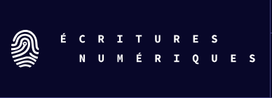

# L’IA décryptée : fondements techniques et enjeux en SHS (DHSI 2026)

       

L’_IA_, ce mot à la mode qui fascine autant qu’il inquiète, est au coeur de tous les débats. Face à la prolifération de discours souvent contradictoires, il devient difficile de se positionner sans tomber dans la panique ou l’enthousiasme aveugle. Alors, comment comprendre les véritables enjeux de cette nouvelle ère technologique ? Et, surtout, quelles connaissances mobiliser pour en évaluer les impacts réels, notamment sur les pratiques en sciences humaines et sociales ?

Pour évaluer la pertinence des outils d’IA dans les SHS, que ce soit pour l’analyse de texte, la modélisation de données ou l’exploration d’archives, il faut d’abord en saisir les fondements techniques, les choix théoriques et les biais structurels qu’ils peuvent véhiculer. Ce cours propose un retour aux bases de l’intelligence artificielle et de l’apprentissage machine dans une approche opérationnelle, rigoureuse et accessible, qui permet de mieux cerner les capacités et les limites de ces outils.

Cette formation est l’opportunité de s’approprier ce sujet avec la perspective critique qu’il mérite tout en dédramatisant ces nouvelles technologies qui bouleversent nos pratiques. Nous invitons chercheur..ses et étudiant..es en SHS avec un intérêt pour la programmation mais sans aucun pré-requis à participer à ce cours introductif aux fondements de l’apprentissage machine pour les SHS.

 
## Enseignant.es

*Alexia Schneider* est doctorante en littérature option humanité numérique à l’Université de Montréal. Elle est membre étudiante du Centre de recherche interuniversitaire sur les humanités numériques (CRIHN) et responsable de projets intégrés au projet Revue3.0 pour la Chaire de recherche du Canada et les écritures numériques. Après des études initiales en littérature française (Université Paris-Sorbonne), elle s’est spécialisée dans le Traitement Automatique des Langues (Université de Strasbourg). Dans le cadre de son doctorat, elle s’intéresse à la recherche d’information en contexte documentaire et en particulier aux pratiques de recherche d’information des chercheureuses ainsi qu’à l’impact des différents modèles d’intelligence artificielle sur la découvrabilité des contenus scientifiques. Elle est récipiendaire d’une bourse doctorale du réseau québécois de recherche Circé.

*Yann Audin* est candidat au doctorat en littérature — option humanités numériques à l’Université de Montréal et récipiendaire d’une bourse doctorale du CRSH. Il est membre étudiant du Centre de recherche interuniversitaire sur les humanités numériques (CRIHN), responsable de projet pour la Chaire de recherche du Canada et les écritures numériques, et fut le représentant étudiant pour la Société canadienne pour les humanités numériques (SCHN/CSDH) de 2022 à 2025. Il est détenteur d’une maîtrise en littérature comparée de l’Université de Montréal et d’une maîtrise en physique de Bishop’s University. Yann coordonne et coanime la baladodiffusion Skholé – Théories dysfonctionnelles et a lancé dernièrement un blog de recherche : https://yann-audin.github.io/Cybermeneutics/. À l’été 2025, il s’est vu décerner le prix de la promesse étudiante Ian Lancashire et sa dernière publication peut être lue dans la revue Digital Studies / Le champ numérique.

*William Bouchard* est doctorant en humanités numériques à l’Université de Montréal, membre étudiant du Centre de recherche interuniversitaire sur les humanités numériques (CRIHN) et responsable de projet pour la Chaire de recherche du Canada et les écritures numériques. Formé en études classiques, il s’intéresse à la modélisation des pratiques éditoriales savantes, en particulier dans le champ de la philologie grecque. Ses recherches portent sur l’édition critique numérique, la représentation de la variation textuelle et la structuration des données littéraires. Il explore l’usage de méthodes computationnelles, notamment l’apprentissage automatique, pour analyser, enrichir et reconfigurer les formes d’édition et de lecture des corpus anciens.

Philosophe et spécialiste d’édition numérique, *Marcello Vitali-Rosati* est professeur au département des littératures de langue française de l’Université de Montréal, titulaire de la Chaire de recherche du Canada sur les écritures numériques et de la Chaire d’excellence en édition numérique à l’Université de Rouen. Il développe une réflexion philosophique sur ce que devient le monde à l’ère des technologies numériques. À partir de l’étude et de la pratique du code, il analyse la manière dont les algorithmes, les formats, les logiciels et les plateformes redéfinissent les notions d’humain, d’identité, de connaissance ou de littérature. Contributeur actif à la théorie de l’éditorialisation, il travaille à la conception de nouvelles formes de production et de diffusion du savoir ainsi qu’à l’élaboration de chaînes éditoriales innovantes. Il est l’auteur de nombreux articles et monographies et exerce également une activité d’éditeur en tant que directeur de la revue Sens public et co-directeur de la collection “Parcours Numériques” aux Presses de l’Université de Montréal. Il est à la tête de plusieurs projets en humanités numériques, particulièrement dans le domaine de l’édition savante: des plateformes d’édition de revues et de monographies enrichies, de l’éditeur de texte Stylo ainsi que d’une plateforme d’édition collaborative de l’Anthologie Grecque.

## Préparation pour le cours

Les activités pratiques se feront en Python dans des Jupyter Notebooks. Les notebooks seront partagés dans un format exécutable sans installation complexe, à condition de disposer _a minima_ d’un compte Google. Pour les personnes souhaitant travailler localement, nous recommandons l’installation de *Python 3.10* via un gestionnaire de paquets comme [Anaconda]("https://www.anaconda.com/docs/getting-started/main") ou [Poetry]("https://python-poetry.org/docs/"). N’hésitez pas à nous contacter pour toute question liée à l’installation ou pour discuter d’une autre configuration de travail que Colab.

Les participant.es peuvent venir avec leur propre corpus, idéalement au format txt, json ou xml. Un corpus d’exemple sera également fourni pour les exercices et les démonstrations.

